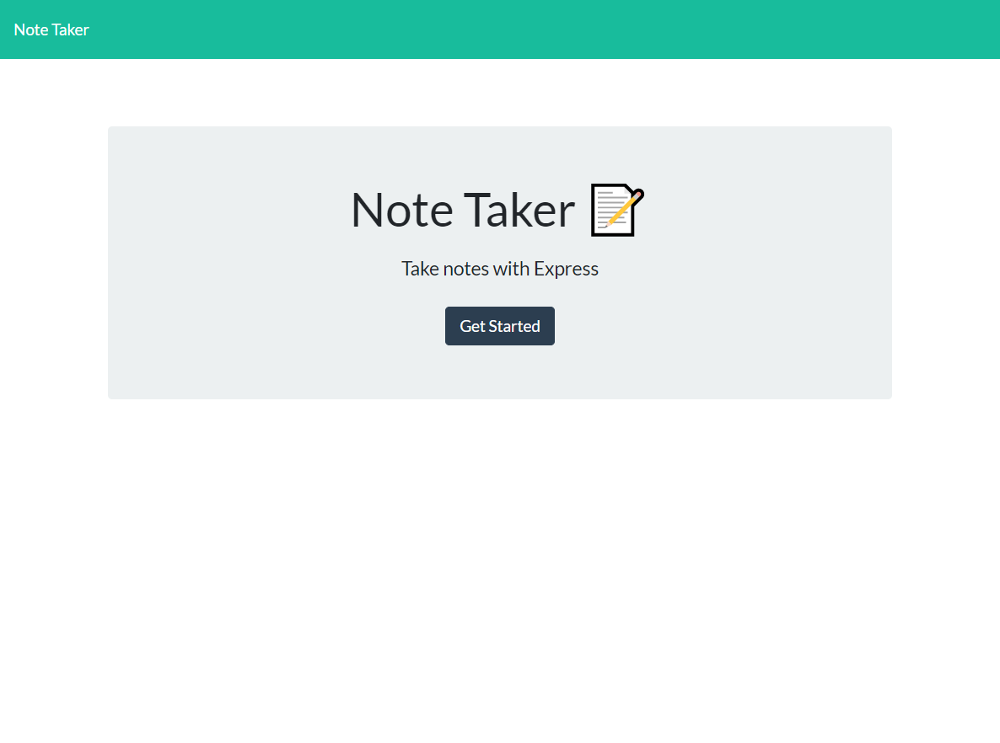
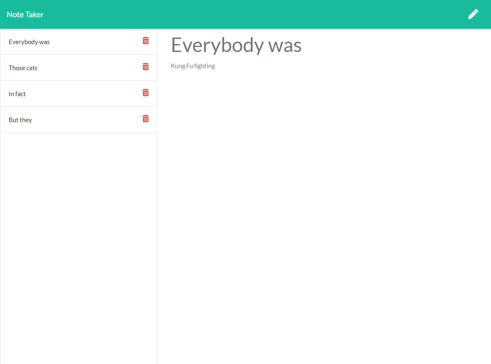

 # Note-Taker

  

  ## Description

   For users that need to keep track of a lot of information, it's easy to forget or be unable to recall something important. Being able to take persistent notes allows users to have written information available when needed. AS A user, I want to be able to write and save notes. I WANT to be able to delete notes I've written before SO THAT I can organize my thoughts and keep track of tasks I need to complete.

  ## Repository

  https://github.com/km4891/note-taker

  ## Screenshots

  ### Homepage
  

  ### Notes app
  

  ## Table of Contents
  - [Installation](#Installation)
  - [Usage](#Usage)
  - [License](#License)
  - [Contributors](#Contributors)
  - [Questions](#Questions)

  ## Installation

  * Node.js 
  * Express.js

  ## Usage

  Link to [Heroku](https://fathomless-springs-39061.herokuapp.com/)

  ## License

  This repository is covered under MIT licensing.

  ## Contributors

  Kyle Morarity and thank you to the TA's and tutor they have helped me along this week. 
  

  ## Questions

  If you have any questions, please feel free to email @ kmorarity@gmail.com.
  
  You can see more of my work at https://github.com/km4891
